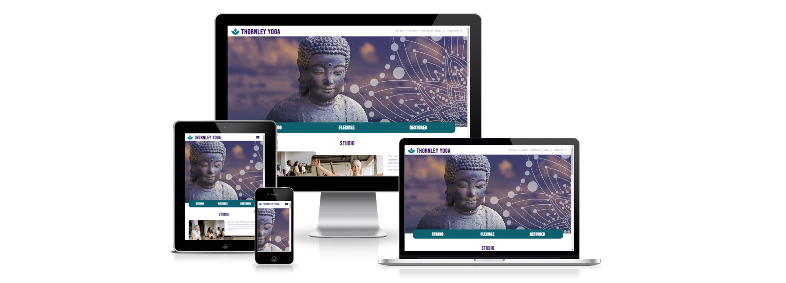
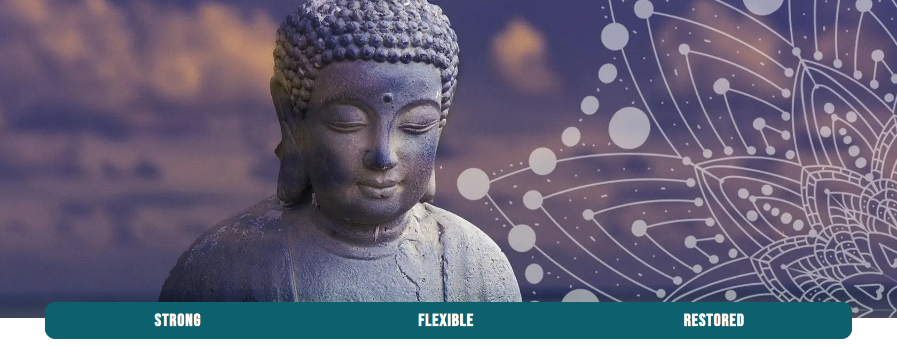
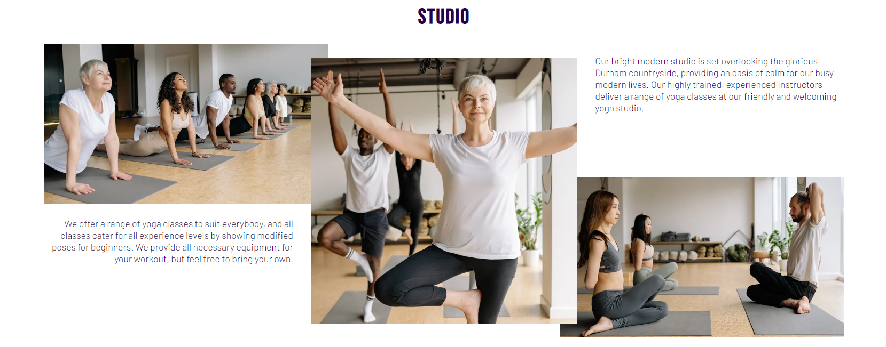
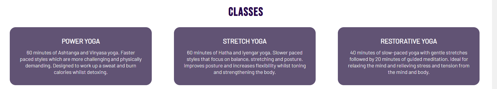
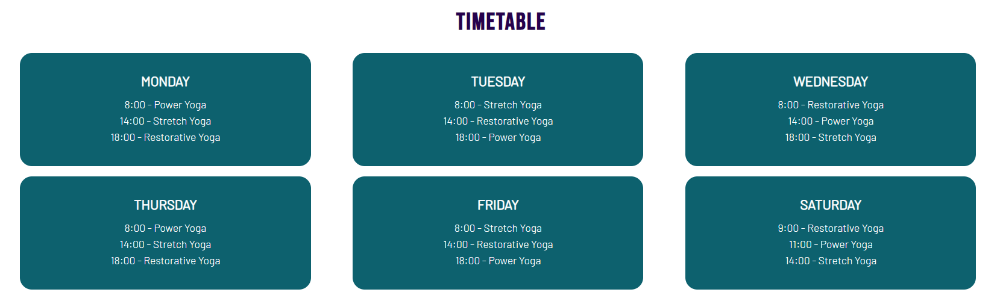
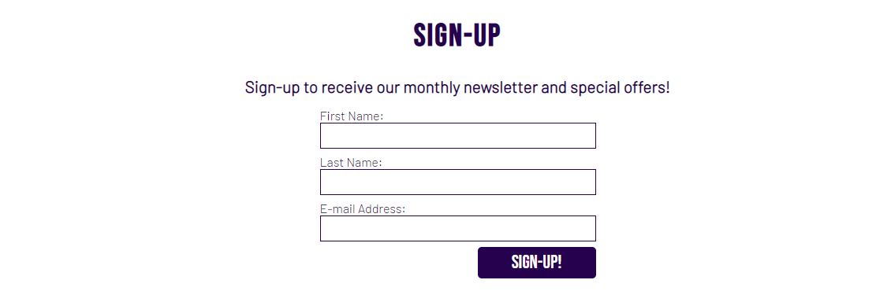
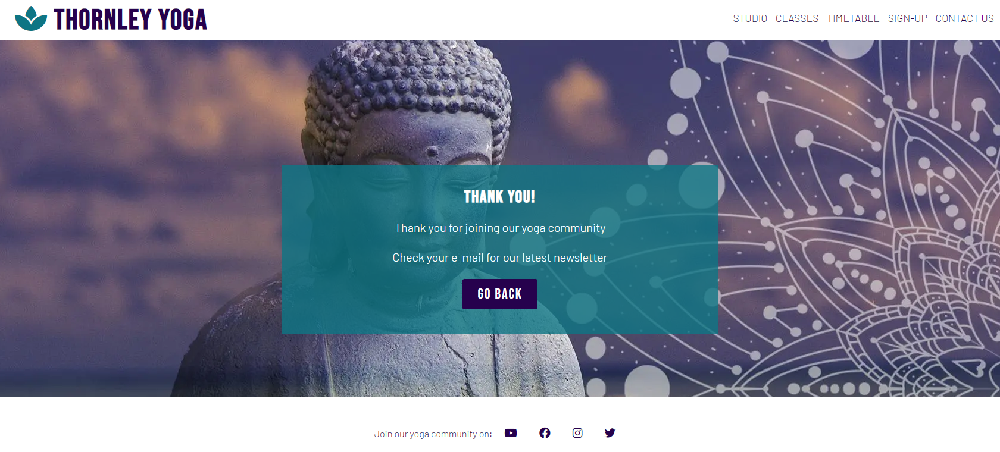
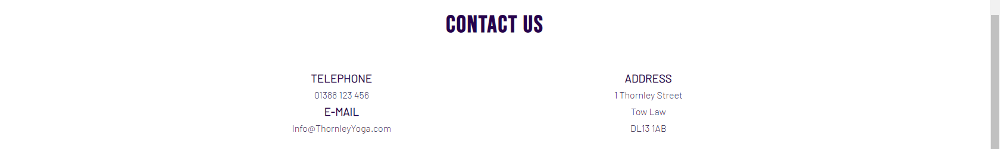
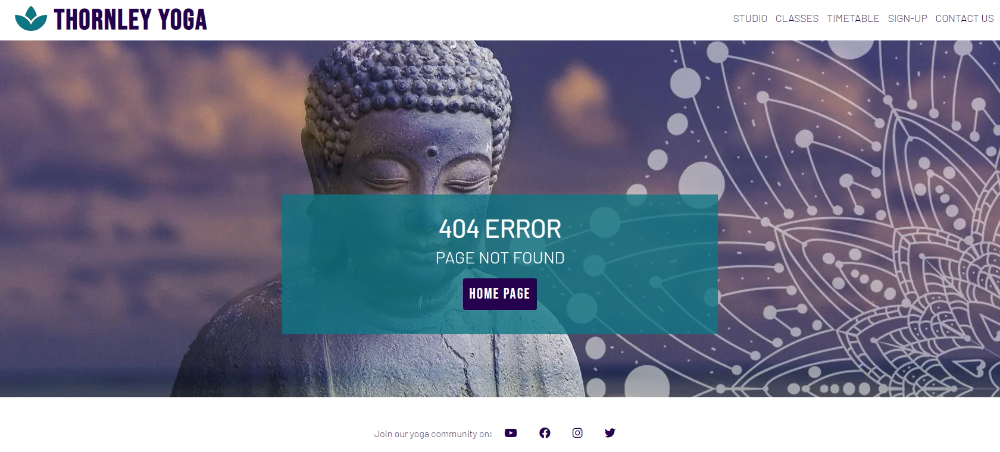
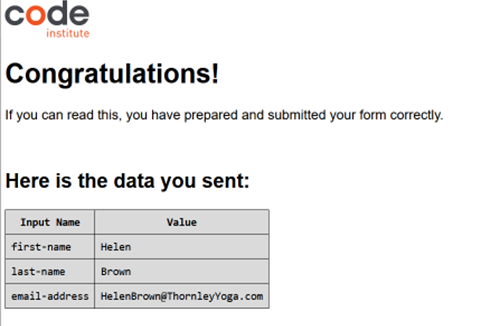

# <h1 align="center">**Thornley Yoga**</h1>

[View the live project here](https://porsil.github.io/thornley-yoga/index.html)

This is the static website for Thornley Yoga. A responsive website designed to be accessible on a range of devices, allowing the information to be found easily.

-   ### **Visitor Goals**

1. Clearly understand the purpose of the site and easily navigate the site to find content, on any screen size.
2. To find information on the studio and instructors.
3. To learn about the classes available and the benefits of the different yoga styles.
4. To get the times of when the different yoga classes are run.
5. To sign up to a monthly newsletter to be e-mailed updates, changes and special offers.
6. To find the best way to get in contact with the studio to ask questions.
7. To find social media links to the yoga community.

-   ### **Wireframes**

    -   Browser Wireframe - [View](assets/read-me-docs/thornley-yoga-browser.pdf)
    -   Tablet Wireframe - [View](assets/read-me-docs/thornley-yoga-tablet.pdf)
    -   Mobile Wireframe - [View](assets/read-me-docs/thornley-yoga-mobile.pdf)
    
-   ### **Design**

    -   The two main colours used are purple and teal.
    -   The main font used throughout the website is Barlow, with Bebas Neue used for the logo, section    headers and the sign-up button. These fonts are clean fonts and compliment each other well.
    -   Incase the fonts do not import into the website correctly, Sans Serif was used as the backup font.
    -   A large hero image is used to catch the user's attention and also to promote a sense of calm.

-   ## **Existing Features**

-   **Navigation Bar**

    -   Alongside the logo of the site, the navigation bar is located at the top of the site with the links arranged horizontally allowing different sections to be easily accessed by the user. The site logo itself is a clickable link to the home page.

-   **Landing Page Image**

    -   The landing includes a calming Buddha image, to give the user a sense of what yoga is about and includes a tag line to show visitors the positive outcome of practising yoga here.

-   **Studio Section**

    -   The studio section will allow the user to learn some basic information about the yoga studio and the experience of practising yoga here.
    -   This section will explain to the user that all experience levels are catered for to encourage all user levels to consider practising at the studio.
    -   Included are supporting images of the yoga studio to allow the user to see what the studio and classes look like.

    

-   **Classes Section**

    -   The classes section will allow the user to learn about the different classes on offer at the studio and the benefits of each class.

-   **Timetable Section**

    -   The timetable section will allow the user to see precisely what time each class will happen.
    -   This section will be updated if the class timetable changes to keep the user up to date.

-   **Sign-up Section**

    -   The sign-up section will allow the user to sign-up to the studio's monthly newsletter and be a part of the community by submitting their full name and e-mail address.
    -   Signing-up will also allow the user to receive any special offers for the studio.
    -    On clicking the sign-up button, the user is directed to a thank-you page to indicate successful submission of the form and offers a button to go back to the home page. This page keeps the header, hero image and footer from the home page for consitancy and allows for easy navigation to all sections of the website.

-   **Contact-Us Section**

    -   The contact-us section will give the user the information required to get in touch with ot visit the studio.
    -   Three methods of communication are given: telephone, e-mail and address.

-   **Footer**

    -   The footer section will allow users to view the social media pages of the studio by providing links to the relevant social media sites.
    -   All links will open via a new tab to give user friendly navigation.
    -   The footer will encourage users to join the community by keeping connected through social media.

-   **404 Page**

    -   A 404 error page was created to notify the user if they attempted to navigate to a page or file that does not exist.
    -   This page offers a button to return to the home page and keeps the header, hero image and footer from the home page for consitancy and allows for easy navigation to all sections of the website.

    
-   **Feastures Left to Implement**

    -   A costings section to allow the user to see the prices of joining the studio. This was not part of the initial design but would be beneficial to site users.
    -   An embedded map to show the location of the studio in the contact us section. This was in the initial design but was not implemented in the project.

-   ## **Responsiveness**

The website is responsive on all device sizes and to maximise the websites visual appeal and useability of the site there are three 'breakpoints':

-   **876px and above**

    -   The navigation links are listed horizontally, the studio section contains three pictures around two blocks of text, the classes are listed horizontally and the timetable is shown in three columns.

-   **651px to 875px**

    -   The navigation links are provided via a hamburger menu, in the studio section the middle picture is removed, the classes are listed vertically and the timetable is shown in two columns.

-   **650px and below**

    -   The studio section is now shown vertically with the two text blocks shown between the two pictures and the timetable is shown in one column.

-   ## **Technologies Used**

-   **Languages Used**

    -   HTML5
    -   CSS3

-   **Framworks, Libraries & Programs Used**

    -   [Google Fonts](https://fonts.google.com/) were used to import the 'Barlow' and 'Bebas Neue' fonts into the style.css file. These fonts are used throughout all pages of the website.
    -   [Font Awesome](https://fontawesome.com/) was used throughout all pages of the website for the logo graphic in the header and the social media icons in the footer.
    -   [Gitpod](https://gitpod.io/) was used for version control by utilizing the Gitpod terminal to commit to Git and push to [Github](https://github.com/) which then stored the project code.
    -   [Balsamiq](https://balsamiq.com/) was used to create the wireframes when designing the website.

-   ## **Testing**

The site was frequently tested during development on Firefox, Google Chrome and Microsoft Edge browsers and included the testing of links and the registration form. Testing also included using the development tools to view the sites layout on different devices as well as using the 'responsive' setting to see at what sizes the layout became distored.

Before the thank-you page was added to the website for completion of the sign-up form, the code was set to submit the form to the Code Institute form dump. 

Once the testing verified the form was submitting the information as required the submit button was changed to be a link to the form-submitted.html page for aesthetic purposes.

-   **Bugs**

    -   In the classes section the three div's were not difficult to keep in equal thirds once the margins and padding was added to the CSS code. This was fixed using box-sizing: border-box; taken from the Code Institute Love Running walkthrough project.
    
    -   Initially the studio section was behaving differently on different browsers, and was hard to maintain intregrity as the screen size changed. This resulted in many media queries to allow the site to be viewed satisfactorily on different screen sizes. After a meeting with my mentor, it was suggested to use display: flex; for this section. The studio section was then updated to use display: flex; which allowed the section to be displayed correctly on the three different browsers.

    - In the classes section the height of the three div's changed at different times when the screen size was changed beacuse the text broke onto a new line at different sizes. This was fixed by adding a container div in the HTML code and using display: flex; on the container and flex: 1; on the three content div's. This solution was given in this [stackoverflow post](https://stackoverflow.com/questions/2997767/how-do-i-keep-two-side-by-side-div-elements-the-same-height/20669539#20669539)
    
    - Once deployed, it was noted that the studio link in the navigation bar no longer worked. When investigated the studio section id has been deleted in error when the above studio fix was implemented. The id was re-instated to allow the link to function correctly.