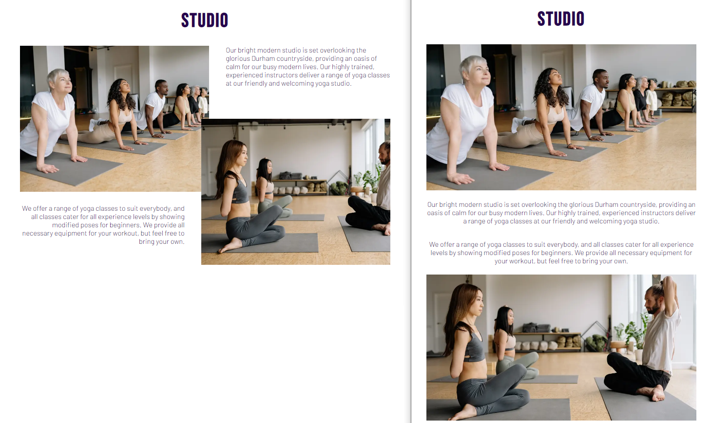

# 
**Thornley Yoga**

[View the live project here](https://porsil.github.io/thornley-yoga/index.html)

This is the static website for Thornley Yoga. A responsive website designed to be accessible on a range of devices, allowing the information to be found easily.

<h2 align="center"></h2>

-   ### **Visitor Goals**

1. Clearly understand the purpose of the site and easily navigate the site to find content, on any screen size.
2. To find information on the studio and instructors.
3. To learn about the classes available and the benefits of the different yoga styles.
4. To get the times of when the different yoga classes are run.
5. To sign up to a monthly newsletter to be e-mailed updates, changes and special offers.
6. To find the best way to get in contact with the studio to ask questions.
7. To find social media links to the yoga community.

-   ### **Wireframes**

    -   Browser Wireframe - [View](assets/read-me-docs/thornley-yoga-browser.pdf)
    -   Tablet Wireframe - [View](assets/read-me-docs/thornley-yoga-tablet.pdf)
    -   Mobile Wireframe - [View](assets/read-me-docs/thornley-yoga-mobile.pdf)

-   ## **Existing Features**

-   **Navigation Bar**

    -   Alongside the logo of the site, the navigation bar is located at the top of the site with the links arranged horizontally allowing different sections to be easily accessed by the user. The site logo itself is a clickable link to the home page.  
    
    -   When the screen size is reduced to below 875px wide and the links no longer fit in the available space, the navigation links are accessed via a hamburger menu.   
    

-   **Landing Page Image**

    -   The landing includes a calming Buddha image, to give the user a sense of what yoga is about and includes a tag line to show visitors the positive outcome of practising yoga here.

-   **Studio Section**

    -   The studio section allows the user to learn some basic information about the yoga studio and the experience of practising yoga here.
    -   This section explains to the user that all experience levels are catered for to encourage all user levels to consider practising at the studio.
    -   Included are supporting images of the yoga studio to allow the user to see what the studio and classes look like.
    -   On large screens, three pictures are visible to allow best use of the space.
    -   When the screen size is reduced to below 875px wide the middle image is removed and on small screens below 650px the layout is aligned vertically. This is to avoid the screen being too crowded.

-   **Classes Section**

-   **Timetable Section**

-   **Sign-up Section**

-   **Contact-Us Section**

-   **Footer**